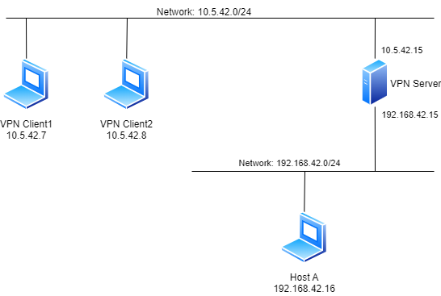

# DogeVPN

<a>
  
</a>

Authors: 
- Andrea Gentilini [880141@stud.unive.it](880141@stud.unive.it)
- Mattia Dei Rossi [885768@stud.unive.it](885768@stud.unive.it)
- Giacomo Civiero [877378@stud.unive.it](877378@stud.unive.it)
- Simone Biondo [879899@stud.unive.it](879899@stud.unive.it)

## Introduction


Implementing a well-managed virtual private network (VPN) is not as simple as it might seem. There are several caveats to consider and several ways to make the entire application non-resilient. Of course there are several pieces of complex code, appropriately packaged, that can help with some effort to build a functional VPN, but how the network works depends on the implementers. For this reason DogeVPN aims to be a simple but functional VPN, with almost all the features of a production-ready VPN. DogeVPN was born from a university project at Ca' Foscari University

## Project structure

The lib directory contains all the library files used by both the client and the
server. It contains:
  - encryption that offers all the methods to enable encryption successfully
    and decryption of every packet exchanged when the VPN is active
  - logging that allows you to monitor the use of all DogeVPN features
  - socket_utils which offer some methods to set up a TCP and UDP sockets used in DogeVPN
  - ssl_utils used to set up an SSL connection in TCP communication between client and server.
    These features allow you to exchange login information securely
  - tun_utils contains all the structures to handle packets from TUN devices
  - vpn_data_utils contains all the functions needed by both the client and the server
    to send the packet in the correct format

## How to build and run a simple test using docker compose

To obtain a complete configuration we decided to use docker compose to configure the clients,
servers and networks. The instructions to compile and run the entire code are
written. The following image shows the network topology of the system.



The configured networks are of the bridge type that allow traffic to be forwarded between network segments.
A bridge network allows containers connected to the same bridge to communicate while providing isolation from
unconnected containers to that same bridge.

### Run the example

To do a simple test of DogeVPN's features we decided to provide a complete setup.
The code written is completely independent of this, although there are some example files
within this repository to allow this example to work correctly.

Build & Run

```bash

docker stop $(docker ps -q) # Stop already running containers
docker container prune -f   # Remove all stopped containers from the system
docker image prune -f       # Removes dangling images, which are not associated with any container and don't have tags
docker network prune -f     # Remove unused networks
docker volume prune -f      # Removes all anonymous volumes not used by any containers

docker compose build
xhost +local:docker         # Allow Qt based GUI to be shown
docker compose up -d        # Start containers again

```
